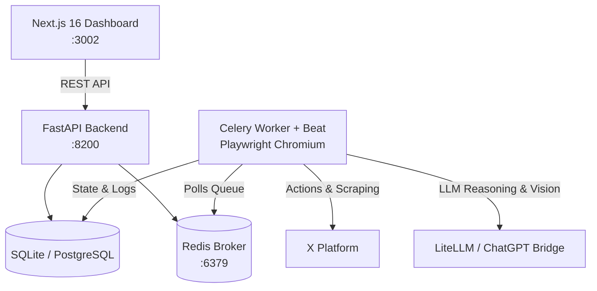

<div align="center">

# 🤖 XBot Pro

**Enterprise Autonomous Social Media Engine for X**

[](https://github.com/jack101a/xbot/actions/workflows/docker.yml)
[](LICENSE)
[](https://www.python.org/)
[](https://nextjs.org/)
[](https://github.com/jack101a/xbot/pkgs/container/xbot-api)

*An intelligent, circadian-scheduled autonomous agent platform with multi-tier LLM reasoning, computer vision synthesis, anti-hallucination memory synthesis, and a real-time glassmorphic control center.*

</div>

---

## 🌟 Key Features

- **🧠 Multi-Tier Reasoning & LLM Cascades**: Intelligent fallback orchestration across primary and lightweight reasoning models for post drafting, thread synthesis, replies, and trend analysis.
- **🕒 Natural Circadian Automation**: Probabilistic session scheduler that mimics human active hours, natural variance delays, and biological pauses.
- **🛡️ Multi-Layer Account Safety**: Sliding-window rate limiters, automated circuit breakers, sentiment guardrails, and taboo topic blacklists.
- **🎨 Glassmorphic Control Dashboard**: Built with Next.js 16, React 19, and Tailwind CSS. Features Persona Memory studio, Growth Engine, Post Pruner, and real-time live activity monitoring.
- **🐳 Turnkey Containerization**: Multi-architecture (`linux/amd64` and `linux/arm64`) Docker images automatically published to GitHub Container Registry (GHCR).

---

## ⚡ Quick Start: Docker (Recommended)

Run the entire system—including Redis, FastAPI backend, Celery automation worker, and the Next.js dashboard—with a single command:

```bash
# 1. Clone repository
git clone https://github.com/jack101a/xbot.git
cd xbot

# 2. Configure environment
cp .env.example .env
nano .env  # Add your LLM keys and gateway settings

# 3. Launch stack
docker compose up -d
```

### Endpoints
- **Admin Dashboard**: [http://localhost:3002](http://localhost:3002)
- **REST API Docs**: [http://localhost:8200/docs](http://localhost:8200/docs)
- **Health Check**: [http://localhost:8200/api/health](http://localhost:8200/api/health)

To view logs or shut down:
```bash
docker compose logs -f
docker compose down
```

---

## 💻 Local Development (Bare-Metal)

### Prerequisites
- Python 3.11+
- Node.js 20+ & npm
- Redis (`redis-server`)

### Using the CLI Manager or Makefile
```bash
# Initialize configuration
cp .env.example .env

# Using Makefile
make start       # Starts Redis, Backend, Celery worker + beat, and Dashboard
make status      # Checks process health
make logs        # Tails consolidated logs
make stop        # Stops all services

# Or using the direct CLI script:
./xbot.sh start
./xbot.sh status
./xbot.sh logs
./xbot.sh stop
```

---

## 🏛️ Architecture Overview



---

## 📁 Repository Structure

```
xbot/
├── .github/workflows/         # CI/CD: Automated multi-arch GHCR image builds
│   └── docker.yml
├── backend/                   # FastAPI REST API & Async Worker Service
│   ├── alembic.ini            # Database migration configuration
│   ├── pyproject.toml         # PEP 621 Python dependencies & tools
│   ├── migrations/            # Alembic schema version history
│   ├── xbot/                  # Core domain logic, ports & adapters
│   │   ├── ai/                # LLM cascades, topic radar, prompts, reflection
│   │   ├── api/               # REST routers (profiles, campaigns, system)
│   │   ├── browser/           # Playwright automation engine & action handlers
│   │   ├── contracts/         # Domain ports & DTOs (Hexagonal Architecture)
│   │   ├── growth/            # F4F community harvesting & relationship tracking
│   │   ├── infra/             # Adapters (browser queue worker, LLM bridges)
│   │   ├── models/            # SQLAlchemy database models
│   │   ├── persona/           # Character cards, worldview engine, memory/diary
│   │   ├── pipelines/         # High-level autonomous workflows
│   │   ├── safety/            # Circuit breakers & rate limiters
│   │   ├── scheduling/        # Circadian algorithms & active windows
│   │   └── tasks/             # Celery background tasks & session loops
│   └── tests/                 # Automated Pytest suite (60+ tests)
├── dashboard/                 # Next.js 16 Glassmorphic Control Center
│   ├── src/app/               # App Router layouts and routes
│   ├── src/features/          # Persona Studio, Growth Engine, Post Pruner
│   ├── src/lib/               # API clients, utilities, and date parsers
│   └── src/store/             # Zustand state management
├── docker/                    # Container Dockerfiles
│   ├── Dockerfile.api         # Python 3.11 slim backend image
│   └── Dockerfile.worker      # Playwright + Chromium worker (Dual AMD64/ARM64)
├── docs/                      # Technical documentation & design specifications
├── scripts/                   # Operator tools, backup scripts & diagnostics
├── docker-compose.yml         # Multi-service container specification
├── Makefile                   # Standard developer & operator commands
├── xbot.sh                    # Unified service orchestrator CLI
├── LICENSE                    # MIT License
└── README.md
```

---

## 🚢 CI/CD & Registry Automation

Every commit pushed to `main` automatically triggers `.github/workflows/docker.yml` to build multi-architecture container images for both **`linux/amd64`** and **`linux/arm64`** via Docker Buildx and QEMU:

| Service | Image | Architectures |
| :--- | :--- | :--- |
| **API** | `ghcr.io/jack101a/xbot-api:latest` | `amd64`, `arm64` |
| **Worker** | `ghcr.io/jack101a/xbot-worker:latest` | `amd64`, `arm64` |
| **Dashboard** | `ghcr.io/jack101a/xbot-dashboard:latest` | `amd64`, `arm64` |

---

## 📄 License

This project is licensed under the [MIT License](LICENSE).
